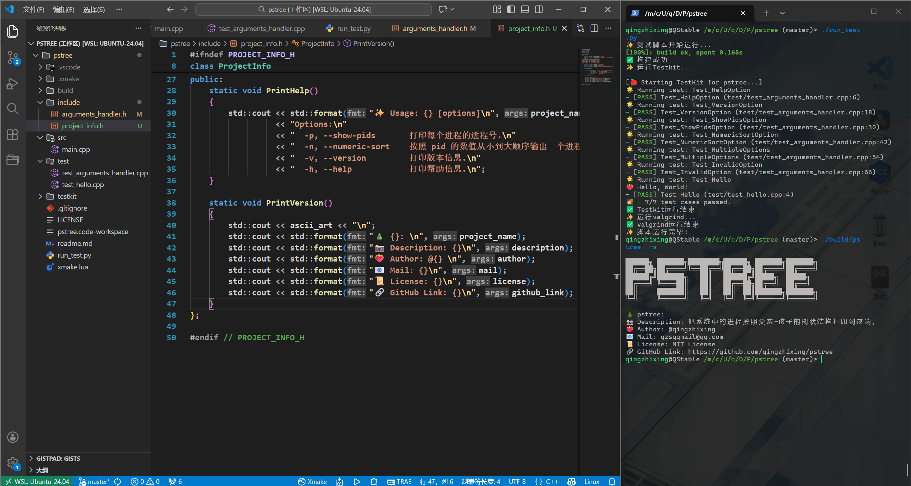

# 打印进程树 (pstree)

## ❤️‍🔥 项目信息
本项目来自 jyy OS 2025 课程的 [M2 实验](https://jyywiki.cn/OS/2025/labs/M2.md)

## 🎵 描述
把系统中的进程按照父亲-孩子的树状结构打印到终端。  

* -p 或 --show-pids: 打印每个进程的进程号。

* -n 或 --numeric-sort: 按照 pid 的数值从小到大顺序输出一个进程的直接孩子。

* -v 或 --version: 打印版本信息。

## 🌈 运行效果图

